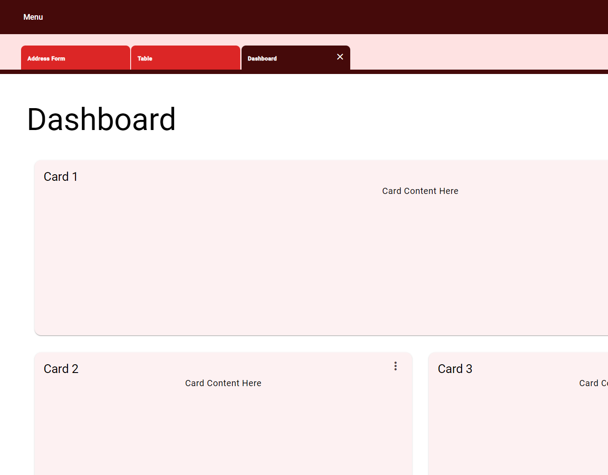

# Angular Application Tabs Example

This example demostrates the example of creating application level tabs by using RouteReuseStrategy

This project was generated with [Angular CLI](https://github.com/angular/angular-cli) version 18.2.11.

## Development server

Run `ng serve` for a dev server. Navigate to `http://localhost:4200/`.
